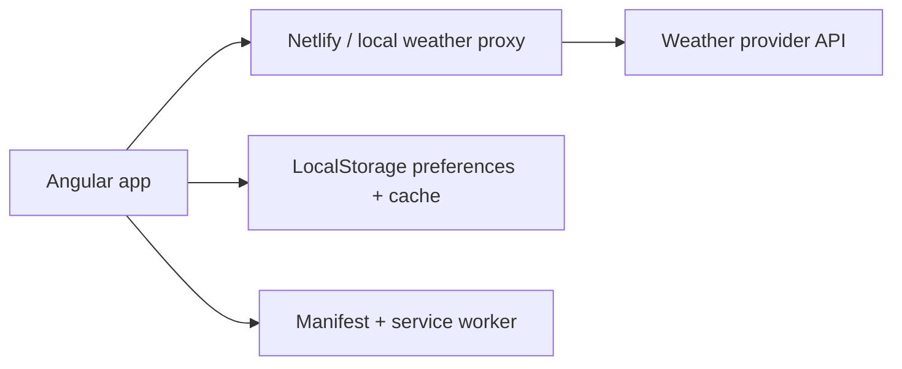

# Clearcast

Clearcast is a polished weather dashboard built as a portfolio-grade Angular application. It turns live weather, air quality, hourly forecasts, saved locations, and planning guidance into a responsive app experience with a secure serverless API layer.

[Live Demo](https://clearcast-weather.netlify.app) | [Netlify Project](https://app.netlify.com/projects/clearcast-weather)

## Highlights

- Modern responsive weather dashboard with dark/light themes
- City search, geolocation lookup, saved locations, and persisted preferences
- Current conditions, hourly forecast rail, 5-day forecast, AQI, wind, humidity, pressure, visibility, sunrise/sunset, and daylight progress
- Smart briefing for comfort, commute, outdoor suitability, and best short-range weather window
- Chart.js trend visualization for temperature and rain chance
- Interactive detail drawer for hourly and daily forecasts
- Netlify serverless function proxy so API credentials stay out of the browser bundle
- PWA metadata, app icon, shell caching, and last-known dashboard recovery
- Loading, empty, error, and retry states designed for real-world API behavior

## Tech Stack

| Area | Tools |
| --- | --- |
| Frontend | Angular 14, TypeScript, RxJS |
| Data visualization | Chart.js, ng2-charts |
| Styling | Custom CSS, responsive grid layouts, Font Awesome |
| Runtime config | dotenv-generated app config |
| Serverless | Netlify Functions |
| Deployment | Netlify |

## Architecture



The Angular app only receives browser-safe proxy URLs. Weather provider endpoints, host headers, and API keys are read by the local proxy or Netlify Functions from environment variables.

## Local Setup

Install dependencies:

```bash
npm install
```

Create a local environment file:

```bash
cp .env.example .env
```

Fill in `.env` with your weather provider values. Keep `.env` private.

Start the app:

```bash
npm start
```

Open:

```text
http://localhost:4200/
```

`npm start` runs the local Node proxy and Angular dev server together, so API keys stay server-side during development.

## Environment Variables

`.env.example` intentionally contains blank values for provider-specific details. The real values belong in local `.env` and Netlify environment variables.

| Variable | Used by | Purpose |
| --- | --- | --- |
| `WEATHER_API_PROXY_URL` | Browser build | Local or Netlify weather proxy route |
| `XWEATHER_ALERTS_PROXY_URL` | Browser build | Optional alerts proxy route |
| `WEATHER_API_BASE_URL` | Proxy/function | Current weather endpoint |
| `WEATHER_FORECAST_API_URL` | Proxy/function | Forecast endpoint |
| `WEATHER_AIR_POLLUTION_API_URL` | Proxy/function | Air quality endpoint |
| `WEATHER_GEOCODING_API_URL` | Proxy/function | Location search endpoint |
| `WEATHER_API_HOST_HEADER_NAME` | Proxy/function | Provider host header name |
| `WEATHER_API_HOST_HEADER_VALUE` | Proxy/function | Provider host header value |
| `WEATHER_API_KEY_HEADER_NAME` | Proxy/function | Provider API key header name |
| `WEATHER_API_KEY_HEADER_VALUE` | Proxy/function | Provider API key |
| `XWEATHER_CLIENT_ID` | Optional alerts function | Xweather client ID |
| `XWEATHER_CLIENT_SECRET` | Optional alerts function | Xweather client secret |

Generated browser config is written to `src/app/app.environment.ts`, which is ignored by git.

## Scripts

```bash
npm start         # Generate app config, start local proxy, and run Angular
npm run build     # Generate app config and build production assets
npm run test      # Run Karma unit tests
npm run proxy     # Run only the local API proxy
```

## Deployment

The project is configured for Netlify:

- `netlify.toml` sets the build command, publish directory, functions directory, and SPA redirect.
- `netlify/functions/weather.js` proxies weather API requests.
- `netlify/functions/xweather-alerts.js` supports optional severe weather alerts.

Production build output:

```text
dist/weather-app
```

Required Netlify settings:

- Add the environment variables listed above in the Netlify project settings.
- Keep `WEATHER_API_KEY_HEADER_VALUE` marked as secret.
- The browser should only receive proxy URLs, not provider API keys.

## Project Structure

```text
src/
  app/
    models/              Weather, forecast, alert, and location types
    services/            Weather API client
    utils/               Weather formatting and scoring helpers
    app.component.*      Main dashboard UI and behavior
  assets/                Logo and visual assets
  main.ts                Angular bootstrap
  manifest.webmanifest   PWA metadata
  sw.js                  Lightweight service worker

netlify/
  functions/             Serverless API proxy handlers

scripts/
  generate-env.js        Builds browser-safe runtime config
  dev-proxy.js           Local API proxy
  start-dev.js           Starts proxy + Angular dev server
```

## Portfolio Notes

Clearcast was designed to feel like a real consumer weather app rather than a demo page. The project focuses on:

- Secure client/server separation for API credentials
- Resilient data loading and fallback behavior
- Dense but readable dashboard layout
- Responsive interaction patterns for desktop and mobile
- Practical UX details like saved locations, persisted units/theme, and retryable errors

## Status

Current production URL:

[https://clearcast-weather.netlify.app](https://clearcast-weather.netlify.app)

Live weather data requires valid provider credentials in Netlify environment variables.
