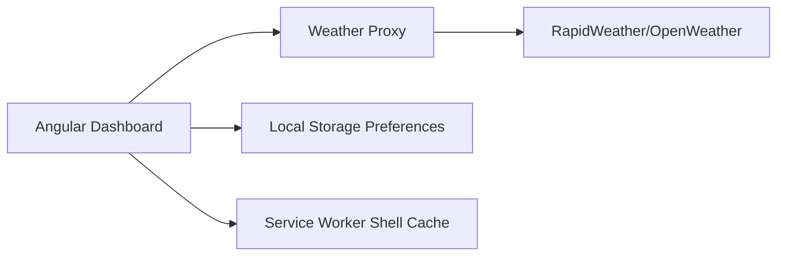

# SkySense Weather Dashboard

Premium Angular weather dashboard powered by the RapidWeather/OpenWeather API surface. It includes current conditions, short-range planning, extended outlooks, air quality, saved locations, and a responsive SaaS-style interface.

## Features

- Current weather hero with feels-like temperature, condition icon, local time, rain chance, and AQI summary
- Search by city with geocoding autocomplete when supported by the API provider
- Keyboard-navigable search suggestions with clear and no-results states
- Use current browser location
- Favorite locations persisted in local storage with manage, rename, remove, and reorder controls
- Fahrenheit/Celsius unit toggle persisted across sessions
- Dark/light mode toggle persisted across sessions
- Hourly forecast strip and Chart.js temperature/rain trend
- Clickable hourly and daily forecast detail drawer
- 5-day forecast with high/low, humidity, wind, and precipitation chance
- Wind speed/direction, pressure, humidity, visibility, cloud cover, precipitation, sunrise/sunset, and daylight progress
- Air quality index and pollutant snapshot when the provider exposes air pollution data
- Production-ready Netlify function proxy so deployed builds do not expose the RapidAPI key in the browser bundle
- First-load recovery: browser location, saved favorite, Tampa fallback, then demo-mode fallback if the provider is unavailable
- Planning scores for comfort, commute risk, and outdoor suitability
- Mobile bottom action bar for location, save, units, and theme
- Location intelligence map with coordinates, timezone, and data-source transparency
- Best outdoor planning window derived from hourly forecast conditions
- PWA manifest, installable app metadata, service worker shell cache, and cached last-known dashboard restore
- Loading skeletons, empty states, retryable error states, keyboard-accessible controls, and responsive mobile layout

## Tech Stack

- Angular 14
- RxJS
- Chart.js with ng2-charts
- Font Awesome icons
- dotenv-powered environment generation

## Setup

1. Install dependencies:

   ```bash
   npm install
   ```

2. Create your local environment file:

   ```bash
   cp .env.example .env
   ```

3. Add your RapidAPI key to `.env`:

   ```bash
   WEATHER_API_KEY_HEADER_VALUE=your_real_api_key
   ```

4. Start the development server:

   ```bash
   npm start
   ```

5. Open `http://localhost:4200/`.

## Environment Variables

The app generates Angular environment files before `npm start` and `npm run build`.

| Variable | Purpose |
| --- | --- |
| `WEATHER_API_PROXY_URL` | Optional browser-facing proxy URL. Use `/.netlify/functions/weather` for Netlify production builds. Leave blank for local direct API calls. |
| `WEATHER_API_BASE_URL` | Current weather endpoint |
| `WEATHER_FORECAST_API_URL` | 5-day / 3-hour forecast endpoint |
| `WEATHER_AIR_POLLUTION_API_URL` | Air pollution endpoint |
| `WEATHER_GEOCODING_API_URL` | Direct geocoding/autocomplete endpoint |
| `WEATHER_API_HOST_HEADER_NAME` | RapidAPI host header name |
| `WEATHER_API_HOST_HEADER_VALUE` | RapidAPI host value |
| `WEATHER_API_KEY_HEADER_NAME` | RapidAPI key header name |
| `WEATHER_API_KEY_HEADER_VALUE` | RapidAPI key value |

Real `.env` files and generated Angular environment files are ignored by git. `.env.example` contains safe placeholders only.

When `WEATHER_API_PROXY_URL` is set, the generated Angular environment omits the API key value and the browser calls the proxy instead of RapidAPI directly.

## API Notes

The configured provider uses a RapidAPI proxy for OpenWeather-style endpoints:

- `/data/2.5/weather` for current conditions
- `/data/2.5/forecast` for 5-day forecasts in 3-hour steps
- `/data/2.5/air_pollution` for AQI and pollutant components
- `/geo/1.0/direct` for location search/autocomplete

Some RapidAPI plans/providers may not expose every upstream endpoint. The UI handles missing forecast, autocomplete, and air-quality responses gracefully.

Live radar/weather map layers are not enabled by default because both Xweather Maps and OpenWeather tile layers require separate map/tile credentials. The current map card uses OpenStreetMap for location context and clearly states when radar layers are unavailable.

## Xweather Free/Trial Endpoint Ideas

This project still uses the configured RapidWeather/OpenWeather provider. If you later add Xweather credentials, the highest-value Xweather endpoints to explore on the free developer trial or PWS contributor access are:

- `/conditions` for current conditions from Xweather
- `/forecasts` for daily/hourly forecast periods
- `/alerts` and `/alerts/summary` for active severe weather events
- `/airquality/index`, `/airquality`, and `/airquality/forecasts` for AQI and pollutant forecasts
- `/lightning` for recent lightning activity where included in your access
- `/fires` for active fire data and risk workflows
- `/tropicalcyclones` for active tropical systems
- `/roadweather` for road-surface condition forecasts

Xweather notes that some endpoints require add-ons or use request multipliers, and the public developer trial is for testing rather than commercial production. Check your Xweather dashboard plan before wiring these into the UI.

## Deployment Notes

This repo includes `netlify.toml`, `netlify/functions/weather.js`, and an optional `netlify/functions/xweather-alerts.js` helper kept for future alert work. Netlify builds set proxy URLs, so client-side code calls serverless functions and API credentials stay in Netlify environment variables.

Required Netlify environment variables are the same as `.env.example`, except proxy URLs are supplied by the build command.

For local production-parity development with the proxy, use Netlify CLI:

```bash
netlify dev
```

For regular Angular development, `npm start` still works and calls RapidAPI directly using your local `.env`.

For local production-parity development without Netlify CLI, run:

```bash
npm run start:proxy
```

That starts the local Node proxy and Angular dev server with `/api/weather`.

## Architecture



## PWA Notes

The app includes a lightweight custom service worker at `src/sw.js`, a web manifest, and an SVG app icon. It caches the application shell and restores the last successful weather dashboard from local storage when live provider data is unavailable.

The app caches the application shell and restores the last successful weather dashboard from local storage when live provider data is unavailable.

## Scripts

```bash
npm start      # generate env files and run Angular dev server
npm run start:proxy # run Angular through the local API proxy
npm run build  # generate env files and build production assets
npm test       # run Karma unit tests
```

## Screenshots

Add screenshots here after deploying or running locally:

- Desktop dashboard
- Mobile dashboard
- Light mode
- Error/loading state
